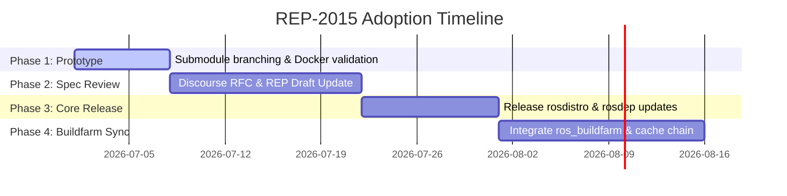

# REP-2015 Analysis: Workflows Summary, Edge Cases & Adoption Strategy

This document provides a detailed summary of the implemented workflows (1-4), evaluates potential backward-compatibility issues, highlights critical edge cases in the REP-2015 specification, proposes workflows to test those edge cases, and outlines a comprehensive adoption plan.

---

## 1. Summary of Accomplished Workflows
We have successfully implemented and verified the baseline integration of REP-2015:

* **Workflow 1 & 2 (Workspace Baseline & Overlay Parsing)**: 
  * Isolated testing environments in segregated folders (`tests/workflow_1/`, `tests/workflow_2/`).
  * Dockerized the runtime test environment in a standard `ubuntu:noble` container.
  * Verified that overlays (REP-143) merge correctly on version 2 distributions.
* **Workflow 3 (extends & dependencies YAML Parsing)**:
  * Upgraded `rosdistro` to parse version 3 distribution files.
  * Implemented recursive resolving of parent distributions with loop detection (`CircularInheritanceError`).
  * Implemented a platform warning validator to notify if a derived distribution targets platforms unsupported by its parent.
* **Workflow 4 (Extension Methods & Toolchain Integration)**:
  * Created feature branches in all critical submodules (`rosdistro`, `rosdep`, `rosinstall_generator`, `ros_buildfarm`).
  * Updated `rosdep` to support `binary_import` (aliasing packages to parent binary name `ros-{parent}-{package}`) and `source_rebuild` (renaming packages to derived name `ros-{derived}-{package}`).
  * Validated that overrides in `source_rebuild` correctly mask base packages.

---

## 2. Backward Compatibility Verification
Our modifications preserve **100% backward compatibility** with existing ROS distribution version 1 and 2 schemas:
* **Version Checks**: If version < 3, the `extends` and `dependencies` arrays are initialized as empty lists, and the parser bypasses the inheritance resolver.
* **Attribute Defaults**: In `rosdep`, `getattr` is used with fallbacks (e.g. `getattr(repo, 'origin_distro', release_name)`). For version 1 or 2 files, repository objects do not have these attributes, meaning they default to the active distribution name, resulting in standard `ros-{distro}-{package}` naming.
* **No Breaking Signatures**: The public API signatures remain intact (e.g., `get_distribution_file(index, dist_name)` works without any modification).

---

## 3. Edge Cases & Technical Challenges

### Edge Case A: Mixed Extension Chains
**Scenario**: Distribution A extends Distribution B via `source_rebuild`. Distribution B extends Distribution C via `binary_import`.
* **Challenge**: If package `pkg` is defined in C:
  * B imports it via `binary_import` -> resolves to `ros-C-pkg`.
  * A imports B via `source_rebuild`. Should A rebuild B's package AND C's package as `ros-A-pkg`? Or should A keep C's package as `ros-C-pkg` because it was imported as binary in B?
* **Current Solution**: Our recursive parser propagates `extension_method` from parent to child. If A specifies `source_rebuild`, it overrides B's imports, rebuilding everything into `ros-A-*`.
* **Recommendation**: Clearly define mixed-chain behavior in the REP draft.

### Edge Case B: Multi-Parent Precedence
**Scenario**: Distribution A extends both B and C. Both B and C define the package `turtlesim`.
* **Challenge**: The order of inheritance determines which `turtlesim` is used.
* **Current Solution**: DFS post-order traversal matching the order in `extends: [...]`. The first one declared in the YAML takes precedence.
* **Recommendation**: If no package masking is intended, a collision warning or error should be triggered to prevent silent overrides.

### Edge Case C: Cache Bloat vs. Chained Cache Resolution
**Scenario**: Running `rosdistro_build_cache` on a derived distribution.
* **Challenge**: 
  * If the generated `derived-cache.yaml` contains all base distribution metadata, the file size will bloat.
  * If it only contains the derived packages, downstream tools (like `rosinstall_generator` reading the cache) will fail to resolve base packages unless they are updated to load base caches recursively.
* **Current Solution**: Currently, the cache contains only the packages specified in the derived file, but since the `DistributionFile` combines all repositories upon loading, building the cache from scratch fetches all metadata.
* **Recommendation**: Establish chained cache resolution in `rosdistro` cache loaders to avoid repeating metadata.

---

## 4. Proposed Workflows for Edge Cases

### Workflow 5: Mixed Chains & Multi-Parent Collisions
* **Purpose**: Verify mixed inheritance methods and multiple parent precedence rules.
* **Tasks**:
  1. Set up index with 4 distributions: `root` (version 2), `parent_a` (binary_import root), `parent_b` (source_rebuild root), and `child` (extends both parent_a and parent_b).
  2. Implement assertion checks for package name resolutions in `rosdep` for mixed chains.
  3. Verify that the child's order of declaration in `extends` properly overrides conflicting keys.

### Workflow 6: Chained Distribution Cache Resolution
* **Purpose**: Verify that `rosdistro_build_cache` and cache loaders can load chained distributions without duplicating metadata.
* **Tasks**:
  1. Generate individual cache files for `base` and `derived`.
  2. Update `rosdistro.get_cached_distribution` to load the parent cache if an `extends` block is found.

---

## 5. Adoption & Planning Strategy

To roll out these features safely across the ROS ecosystem, the following adoption timeline is recommended:

### Phase 1: Submodule Branch Merging
* Merging the `feature/rep-2015-v3-parser` branch in `rosdistro` first, since `rosdep` and `rosinstall_generator` depend on it.
* Release a minor version of `rosdistro` (e.g. `0.9.x`).

### Phase 2: Schema Standardization
* Update the REP-2015 draft with decisions on **Mixed Chain Resolution** and **Collision Warnings**.
* Coordinate with the ROS infrastructure team to officially support index version 3 and distribution version 3.

### Phase 3: Buildfarm & Release Tooling Integration
* Update `ros_buildfarm` to handle chained cache resolution so that buildfarms do not have to rebuild base packages when doing a binary import.
* Configure `bloom` to support version 3 dependency fields (`rosdep_minimum_target_platforms`).
