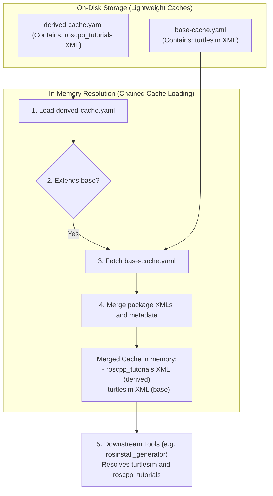

# Workflow 6 Status Report: Chained Cache Resolution

This report details the execution, configurations, results, and critical adoption insights of **Workflow 6: Chained Cache Resolution**.

---

## 1. Objectives & Setup Criteria
The main objective of Workflow 6 was to implement in-memory chained cache resolution for extended distributions. This includes:
1. **Minimal Cache Files**: Ensuring that the cache generation tool (`rosdistro_build_cache`) continues to write lightweight cache files containing only the packages directly defined in the derived distribution.
2. **Chained Cache Loading**: Recursively loading and merging parent cache files in memory when a derived cache is loaded by client tools.
3. **Downstream Integration**: Verifying that consumer tools (like `rosinstall_generator`) can traverse and resolve package definitions across chained caches transparently.

---

## 2. Submodule Modifications

### `rosdistro` (Recursive Cache Merging)
- **Loader Interface** ([__init__.py](https://github.com/KmoM88/rosdistro/blob/feature/rep-2015-v3-parser/src/rosdistro/__init__.py)):
  - Updated `get_distribution_cache` to pass the active `index` parameter to the `DistributionCache` constructor.
- **Recursive Merging** ([distribution_cache.py](https://github.com/KmoM88/rosdistro/blob/feature/rep-2015-v3-parser/src/rosdistro/distribution_cache.py)):
  - Updated `DistributionCache.__init__` to accept the optional `index` parameter.
  - If `index` is provided and the loaded distribution extends other parents, the loader dynamically imports `get_distribution_cache` (avoiding circular dependency loops) and recursively loads the parent caches.
  - The parent cache's `distribution_file` keys, `release_package_xmls`, and `source_repo_package_xmls` are merged into the derived distribution cache instance. Child-level definitions are protected and take precedence over inherited base-level entries.

---

## 3. Added Verification Tests

### A. Isolated Unit Tests
- Created mock cache files `base-cache.yaml` and `derived-cache.yaml` under [test/files/extends/](https://github.com/KmoM88/rosdistro/tree/feature/rep-2015-v3-parser/test/files/extends/).
- Updated `index_extends.yaml` to specify cache locations.
- Added `test_chained_cache_resolution` to the `rosdistro` unit test suite [test_extends.py](https://github.com/KmoM88/rosdistro/blob/feature/rep-2015-v3-parser/test/test_extends.py) to assert in-memory merging of parent caches and package XMLs.

### B. Segregated Integration Tests
- Structure defined under `tests/workflow_6/`:
  - **Index File**: [tests/workflow_6/index.yaml](../tests/workflow_6/index.yaml) (Registers mock index v4).
  - **Base Distro**: [tests/workflow_6/base/distribution.yaml](../tests/workflow_6/base/distribution.yaml) (Declares `turtlesim` using an existing GitHub release).
  - **Derived Distro**: [tests/workflow_6/derived/distribution.yaml](../tests/workflow_6/derived/distribution.yaml) (Extends `base` and declares `roscpp_tutorials`).
- **Test Script** ([test_workflow_6.py](../tests/workflow_6/test_workflow_6.py)):
  - Generates cache files on disk and asserts `derived-cache.yaml` is minimal (excludes `turtlesim`).
  - Loads the distribution in memory and asserts that the chained resolver merges `turtlesim` in.
  - Calls `rosinstall_generator` to verify package resolution across boundaries.



---

## 4. Verification Results

Running the containerized test suite via `bash docker/run_tests.sh` successfully executed the verification steps:

```bash
Running Workflow 6 Chained Cache Resolution Test...
Build cache for "base"
- build cache from scratch
- fetch missing release manifests
.
.  - updated manifest of package 'turtlesim' to version '0.3.9'
- write cache file "base-cache.yaml"
- write compressed cache file "base-cache.yaml.gz"
Build cache for "derived"
- build cache from scratch
- fetch missing release manifests
.
.  - updated manifest of package 'roscpp_tutorials' to version '0.3.9'
- write cache file "derived-cache.yaml"
- write compressed cache file "derived-cache.yaml.gz"
Loading Workflow 6 index from: file:///workspace/tests/workflow_6/index.yaml
Building cache for 'base'...
Building cache for 'derived'...
Verifying base cache...
Verifying derived cache (should be minimal)...
Loading cached distribution for 'derived' (with chaining)...
Testing rosinstall_generator dependency resolution with chained caches...
Rosinstall generator output:
- tar:
    local-name: roscpp_tutorials
    uri: https://github.com/ros-gbp/ros_tutorials-release/archive/release/roscpp_tutorials/0.3.9.tar.gz
    version: ros_tutorials-release-release-roscpp_tutorials-0.3.9
- tar:
    local-name: turtlesim
    uri: https://github.com/ros-gbp/ros_tutorials-release/archive/release/turtlesim/0.3.9.tar.gz
    version: ros_tutorials-release-release-turtlesim-0.3.9

Workflow 6 verification test PASSED!
```

Additionally, `rosdistro` pytest suite passed:
```bash
test/test_extends.py .....                                               [ 21%]
======================== 57 passed, 1 warning in 12.94s ========================
```

---

## 5. Development Pain Points & Adoption Challenges

Implementing and testing Workflow 6 exposed several critical hurdles for the general adoption of REP-2015:

### 1. Circular Import Dependencies in Core Loader
* **Pain Point**: The cache loading functions in `rosdistro/__init__.py` depend on the `DistributionCache` class. Instantiating recursive loader chains inside the `DistributionCache` constructor required referencing `get_distribution_cache`, creating a classic circular dependency loop.
* **Adoption Insight**: Late/dynamic imports inside class methods must be utilized in Python client implementations to break import cycles cleanly.

### 2. Cache Generation vs. Cache Loading Incongruity
* **Pain Point**: The cache builder tool (`rosdistro_build_cache`) builds caches for each distro defined in the index. When constructing the derived cache, it should not merge parent cache records onto the output disk file (to keep files minimal). 
* **Adoption Insight**: The cache loader must behave conditionally. When executing cache compilation steps, it must instantiate cache classes without passing the index hierarchy (saving only local packages), whereas consumer tools (like `rosdep` or `rosinstall_generator`) must pass the index to trigger in-memory chained merging.

### 3. Strict Linter Rules (yamllint) on Mock Cache Files
* **Pain Point**: Mock cache files contain raw, serialized package XML descriptions. In real systems, these are machine-written single-line strings. However, if mock files are checked into git submodules, standard linter configurations (e.g. `yamllint`) will fail due to 80-character line limit rules.
* **Adoption Insight**: Hand-crafted mocks must be formatted using YAML backslash string splits or folded blocks to satisfy strict linters, or the workflows must explicitly exclude mock cache folders.
