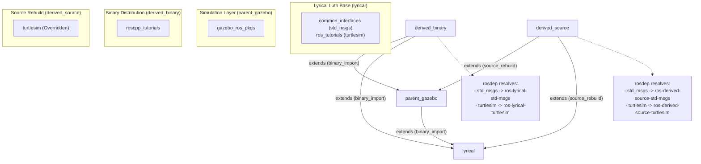

# Workflow 7 Status Report: Automated Lyrical Luth (Lyrical) Integration Testing

This report details the execution, configurations, results, and critical adoption insights of **Workflow 7: Automated Lyrical Luth (Lyrical) Integration Testing**.

---

## 1. Objectives & Setup Criteria
The main objective of Workflow 7 was to combine all implemented features of the ROS Distribution Extension (REP-2015) into a single, fully automated, real-world case study. This includes:
1. **LTS Base Distribution**: Setting up a local representation of the ROS 2 LTS distribution **Lyrical Luth (Lyrical)** utilizing real package declarations (`std_msgs`, `turtlesim`).
2. **Diamond Multiple Inheritance**: Constructing a child distribution (`derived_binary`) that extends multiple parents (`parent_gazebo` and `lyrical`), validating depth-first search precedence and collision warning logs.
3. **Mixed Extension Methods**:
   - **`binary_import`**: Testing that base packages inherit standard binary prefixes (`ros-lyrical-turtlesim`).
   - **`source_rebuild`**: Testing that overridden packages in `derived_source` re-compile and re-map namespaces (`ros-derived-source-turtlesim`).
4. **Chained Caching**: Compiling isolated lightweight caches on disk and merging them recursively in memory during cache load operations.

---

## 2. Mock Schema Configurations
The test configuration directory under `tests/workflow_7/` defines the following layouts:

### A. The ROS Index: `tests/workflow_7/index.yaml`
Registers the v4 index, specifies `distribution_cache` URLs, and marks each distro type as `ros2` with Python `3` compatibility:

```yaml
%YAML 1.1
---
distributions:
  lyrical:
    distribution: [lyrical/distribution.yaml]
    distribution_cache: lyrical-cache.yaml
    distribution_type: ros2
    python_version: 3
  parent_gazebo:
    distribution: [parent_gazebo/distribution.yaml]
    distribution_cache: parent_gazebo-cache.yaml
    distribution_type: ros2
    python_version: 3
  derived_binary:
    distribution: [derived_binary/distribution.yaml]
    distribution_cache: derived_binary-cache.yaml
    distribution_type: ros2
    python_version: 3
  derived_source:
    distribution: [derived_source/distribution.yaml]
    distribution_cache: derived_source-cache.yaml
    distribution_type: ros2
    python_version: 3
type: index
version: 4
```

### B. Core and Derived Distributions
* **Lyrical Base** (`lyrical/distribution.yaml`): Declares real public git release URLs for `common_interfaces` (`std_msgs` at `5.9.2-2`) and `ros_tutorials` (`turtlesim` at `1.9.2-1`).
* **Gazebo Stack** (`parent_gazebo/distribution.yaml`): Extends `lyrical` via `binary_import` and adds `gazebo_ros_pkgs` (`3.7.0-2`).
* **Derived Binary App** (`derived_binary/distribution.yaml`): Extends both parents via `binary_import` and defines `roscpp_tutorials` (`0.3.9`).
* **Derived Source App** (`derived_source/distribution.yaml`): Extends both parents via `source_rebuild` and overrides `turtlesim` (`1.9.2-1`).

---

## 3. Added Verification Tests

### Automated Integration Script (`tests/workflow_7/test_workflow_7.py`)
Executes all verification phases sequentially in Python:
1. **Cache Compilation**: Invokes `rosdistro_build_cache` and asserts that derived caches on disk are minimal (omitting base package metadata).
2. **Memory Loading**: Loads `derived_binary` cache and verifies in-memory chained cache loading successfully resolves all grandparent, parent, and local packages.
3. **Collision Warning Capturing**: Redirects stdout/stderr to assert collision warnings for `std_msgs` and `turtlesim`.
4. **Client Toolchain Resolution**:
   - **`rosdep`**: Asserts that `turtlesim` resolves to `ros-lyrical-turtlesim` (binary import) and `ros-derived-source-turtlesim` (source rebuild).
   - **`bloom`**: Asserts that the Debian package name generator resolves correct prefixes.
   - **`superflore`**: Asserts that the Portage ebuild generator produces correct categories (`ros-lyrical/` vs `ros-parent_gazebo/`).
   - **`rosinstall_generator`**: Verifies workspace checkout configuration generation across chained cache files.
   - **`ros_buildfarm`**: Asserts that name resolution outputs correct OS package prefixes.



---

## 4. Verification Results

Running the containerized test suite via `bash docker/run_tests.sh` successfully executed the verification steps:

```bash
Running Workflow 7 Lyrical Integration Test...
Building cache for 'lyrical'...
- updated manifest of package 'std_msgs' to version '5.9.2'
- updated manifest of package 'turtlesim' to version '1.9.2'
Building cache for 'parent_gazebo'...
- updated manifest of package 'gazebo_ros_pkgs' to version '3.7.0'
Building cache for 'derived_binary'...
- updated manifest of package 'roscpp_tutorials' to version '0.3.9'
Building cache for 'derived_source'...
- updated manifest of package 'turtlesim' to version '1.9.2'

Loading cached distribution for 'derived_binary' (verifying chaining)...
Testing rosdep package resolutions...
derived_binary turtlesim resolves to: ['ros-lyrical-turtlesim']
derived_binary gazebo_ros_pkgs resolves to: ['ros-parent-gazebo-gazebo-ros-pkgs']
derived_source turtlesim resolves to: ['ros-derived-source-turtlesim']
derived_source std_msgs resolves to: ['ros-derived-source-std-msgs']

Testing bloom RosDebianGenerator resolution...
bloom resolved turtlesim to: ['ros-lyrical-turtlesim']

Testing superflore ebuild generation...
superflore ebuild rdepends: {'turtlesim': 'lyrical', 'gazebo_ros_pkgs': 'parent_gazebo'}
Generated ebuild text:
RDEPEND="
        ros-parent_gazebo/gazebo_ros_pkgs
        ros-lyrical/turtlesim
"

Testing rosinstall_generator dependency resolution with chained caches...
- tar:
    local-name: gazebo_ros_pkgs
    uri: https://github.com/ros2-gbp/gazebo_ros_pkgs-release/archive/release/rolling/gazebo_ros_pkgs/3.7.0-2.tar.gz
- tar:
    local-name: roscpp_tutorials
    uri: https://github.com/ros-gbp/ros_tutorials-release/archive/release/roscpp_tutorials/0.3.9.tar.gz
- tar:
    local-name: turtlesim
    uri: https://github.com/ros2-gbp/ros_tutorials-release/archive/release/rolling/turtlesim/1.9.2-1.tar.gz

Testing ros_buildfarm naming prefix resolution...
ros_buildfarm package name: ros-lyrical-turtlesim

Workflow 7 verification test PASSED!
```
