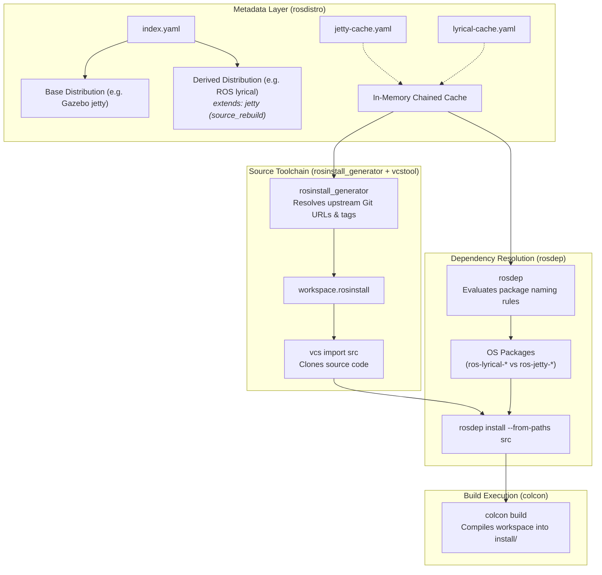

# REP-2015 Toolchain Guide: Normal Workflow & Usage

This guide provides a comprehensive summary of how the ROS toolchain components—**`rosdistro`**, **`rosinstall_generator`**, and **`rosdep`**—interact in a standard development workflow under [REP-2015](https://ros.org/reps/rep-2015.html) (ROS Distribution Extensions).

---

## 1. Overview & Tool Roles

In standard ROS (REP-141/143), distributions are isolated silos. Under **REP-2015**, distributions can form inheritance hierarchies (e.g. `lyrical` extending `jetty`). Each tool in the ecosystem fulfills a distinct, complementary responsibility:



| Tool | Core Responsibility under REP-2015 |
| :--- | :--- |
| **`rosdistro`** | **Distribution Definition, Cache Chaining & Binary Naming**: Parses Version 3 distribution files, verifies inheritance hierarchies (detects cycles, checks platform compatibility), merges repository metadata, provides centralized binary package name formatting, and loads chained multi-tier caches dynamically in memory. |
| **`rosinstall_generator`** | **Cross-Distribution Source Workspace Generation**: Inspects distribution chains to resolve Git repositories, branches, and release tags across distro boundaries to generate `.rosinstall` and `.repos` manifests. |
| **`rosdep`** | **Dependency & Binary Package Resolution**: Translates ROS package names into underlying OS package manager names (`apt`, `dnf`), querying `rosdistro`'s centralized naming engine to resolve binary names based on the extension method (`source_rebuild` vs `binary_import`). |
| **`vcstool`** | **Source Checkout**: Reads generated `.rosinstall` manifests and clones repositories into the local `src/` directory. |
| **`colcon`** | **Compilation & Installation**: Builds the source workspace and generates local overlay environment setup scripts (`setup.bash`). |

---

## 2. Standard Development Workflow

Here is the step-by-step lifecycle of defining, consuming, resolving, and building a project in an extended distribution:

### Step 1: Define the Extended Distribution (`rosdistro`)

The derived distribution specifies its parent distribution and extension method in its distribution file (`distribution.yaml` format version 3):

```yaml
%YAML 1.1
---
type: distribution
version: 3
distribution_type: ros2
release_platforms:
  ubuntu: [resolute]
extends:
  - distro_name: jetty
    extension_method: source_rebuild

repositories:
  ros_gz:
    source:
      type: git
      url: https://github.com/gazebosim/ros_gz.git
      version: lyrical
    status: maintained
```

And both distributions are registered in `index.yaml`:
```yaml
distributions:
  jetty:
    distribution: [jetty/distribution.yaml]
    distribution_cache: jetty-cache.yaml
  lyrical:
    distribution: [lyrical/distribution.yaml]
    distribution_cache: lyrical-cache.yaml
```

* **What `rosdistro` does**:
  1. Loads `lyrical/distribution.yaml`.
  2. Resolves `extends: jetty` and loads `jetty/distribution.yaml`.
  3. Merges parent repository specifications into the child.
  4. Dynamically chains `lyrical-cache.yaml` with `jetty-cache.yaml` in memory without requiring flattened, duplicated cache files on disk.

---

### Step 2: Generate the Source Workspace (`rosinstall_generator`)

When developers need to check out and build packages from source, they run `rosinstall_generator` targeting the derived distribution:

```bash
# Export local index URL (or defaults to official index)
export ROSDISTRO_INDEX_URL="file:///workspace/index.yaml"

# Generate rosinstall for a package inherited from the base distribution
rosinstall_generator gz-cmake --rosdistro lyrical --upstream > custom_ws.rosinstall

# Or generate for multiple packages including downstream bridges:
rosinstall_generator gz-cmake ros_gz_bridge --rosdistro lyrical --upstream > custom_ws.rosinstall

# Or generate for an entire distribution:
rosinstall_generator ALL --rosdistro lyrical --upstream > full_ws.rosinstall
```

* **What `rosinstall_generator` does**:
  1. Queries the derived distribution `lyrical`.
  2. If the package (`gz-cmake`) is defined in parent distribution `jetty`, it traverses the inheritance chain.
  3. Evaluates tag templates (e.g., `tags: {release: 'gz-cmake5_{upstream_version}'}`) and resolves the exact Git tag (`gz-cmake5_5.1.1`).
  4. Outputs a unified `.rosinstall` YAML manifest with Git URLs and commit tags.

---

### Step 3: Clone the Source Repositories (`vcstool`)

Using the `.rosinstall` file generated by `rosinstall_generator`, developers clone all required repositories into their workspace:

```bash
mkdir -p ws/src
cd ws
vcs import src < custom_ws.rosinstall
```

* **What `vcstool` does**:
  1. Iterates over all entries in `custom_ws.rosinstall`.
  2. Clones repositories from GitHub/GitLab into `src/`.
  3. Checks out the exact release tags or branches.

---

### Step 4: Resolve & Install Dependencies (`rosdep`)

Once sources are present in `src/`, `rosdep` inspects each package's `package.xml` and translates dependencies into OS packages:

```bash
# Resolve dependencies for all packages checked out in src/
rosdep install --from-paths src --ignore-src -y --rosdistro lyrical
```

Or query single package resolutions manually:
```bash
# Check how a package name resolves for Ubuntu Resolute
rosdep resolve std_msgs --rosdistro lyrical --os=ubuntu:resolute
# Output: ros-lyrical-std-msgs

rosdep resolve gz-sim --rosdistro lyrical --os=ubuntu:resolute
```

* **What `rosdep` does**:
  * Queries `rosdistro`'s `get_binary_package_name()` engine to resolve OS package names:
    * **Under `source_rebuild`**:
      * Packages rebuilt into the downstream environment are renamed with the downstream prefix:
        * `std_msgs` $\rightarrow$ `ros-lyrical-std-msgs`
        * `ros_gz_sim` $\rightarrow$ `ros-lyrical-ros-gz-sim`
    * **Under `binary_import`**:
      * Packages imported from the base distribution retain their original upstream binary name:
        * `std_msgs` $\rightarrow$ `ros-jetty-std-msgs` (installed into `/opt/ros/jetty`)
      * Disallows child distributions from overriding parent packages to preserve ABI compatibility.
  * **System Dependencies**:
    * Resolves generic C++ libraries (`libboost-dev`, `tinyxml2`, `cmake`) using OS package manager rules.

---

### Step 5: Build and Source the Workspace (`colcon`)

Finally, the developer builds the unified workspace:

```bash
colcon build --symlink-install
```

And sources the local overlay environment:
```bash
source install/setup.bash
```

* **What `colcon` does**:
  1. Discovers all packages in `src/` (CMake, ament_cmake, Python packages).
  2. Builds packages in topological order.
  3. Installs binaries, headers, and libraries into `install/`.
  4. Generates environment hooks (`setup.bash`) allowing ROS and Gazebo executables to find all libraries and plugins.

---

## 3. CLI Command Cheatsheet

### `rosdistro`
```bash
# Build / rebuild a distribution cache on disk
rosdistro_build_cache file:///path/to/index.yaml lyrical

# Inspect distribution inheritance via Python API
python3 -c "
import rosdistro
idx = rosdistro.get_index('file:///path/to/index.yaml')
dist = rosdistro.get_distribution_file(idx, 'lyrical')
print('Extends:', [(e.distro_name, e.extension_method) for e in dist.extends])
print('Total Repos:', len(dist.repositories))
"
```

### `rosinstall_generator`
```bash
# Single package checkout with release tag
rosinstall_generator gz-cmake --rosdistro lyrical --upstream

# Single package checkout using development branch
rosinstall_generator gz-cmake --rosdistro lyrical --upstream-development

# Package and its recursive dependencies
rosinstall_generator ros_gz_bridge --rosdistro lyrical --deps --upstream

# Output in .repos format (used by vcs import)
rosinstall_generator gz-sim --rosdistro lyrical --upstream --format repos

# Full distribution checkout specification
rosinstall_generator ALL --rosdistro lyrical --upstream > full_distribution.rosinstall
```

### `rosdep`
```bash
# Update local rosdep sources cache
rosdep update

# Query the binary OS package name for a ROS dependency
rosdep resolve <package_name> --rosdistro <distro_name> --os=<os_name>:<os_version>

# Install all missing dependencies for checked out source packages
rosdep install --from-paths src --ignore-src -y --rosdistro <distro_name>

# Check if all dependencies for a workspace are already satisfied
rosdep check --from-paths src --rosdistro <distro_name>
```

---

## 4. Troubleshooting & Best Practices

1. **Target Platform Warnings**:
   * If derived distributions specify newer OS targets (e.g. `ubuntu:resolute`) not declared in base distributions (e.g. `ubuntu:noble`), `rosdistro` issues descriptive warnings. Ensure derived targets are compatible with or subsets of base targets.
2. **ABI Invariant in `binary_import`**:
   * Never override a repository in a child distribution when using `binary_import`. If custom overrides or patches are needed, use `extension_method: source_rebuild`.
3. **Chained Caches vs. Offline Builds**:
   * Do not duplicate parent distribution packages into child cache files. Keep child caches minimal to prevent cache desynchronization across upstream updates.
