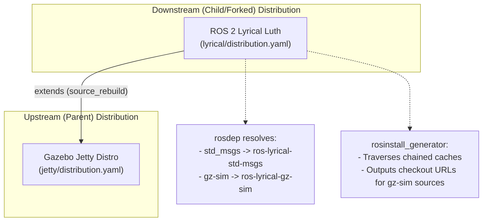

# Workflow 9: Lyrical and Gazebo Jetty Integration Plan

This plan details the design, configuration steps, and toolchain commands to establish our modified **`lyrical`** distribution as a downstream distribution extending the custom **`jetty`** Gazebo distribution.

---

## 1. Context & Architectural Overview

Instead of creating a third separate distribution overlay, we will configure the **`lyrical`** distribution itself to extend the custom **`jetty`** Gazebo distribution:
* **Upstream (Parent)**: The custom Gazebo **`jetty`** distribution (hosted on the `gazebo-tooling/gazebodistro` repository under the branch `jrivero/jetty-rosdistro`).
* **Downstream (Child)**: Our modified/forked **`lyrical`** distribution.
* **Source Rebuild**: `lyrical` extends `jetty` via `source_rebuild`, meaning all Gazebo packages are rebuilt from source in our workspace and prefix-translated into the `lyrical` namespace (`ros-lyrical-gz-sim`).



---

## 2. Step-by-Step Configuration

### Step A: Define the Index file (`index.yaml`)
Create an index file linking both distributions together:

```yaml
# index.yaml
distributions:
  jetty:
    # Points to the local submodule Gazebo distribution file
    distribution: [submodules/gazebodistro/rosdistro/jetty/distribution.yaml]
    distribution_type: ros2
    python_version: 3
  lyrical:
    # Points to our modified distribution file
    distribution: [lyrical/distribution.yaml]
    distribution_type: ros2
    python_version: 3
type: index
version: 4
```

### Step B: Modify Lyrical Distribution File (`lyrical/distribution.yaml`)
Upgrade our local `lyrical` distribution file to format version 3 and add the `extends` block:

```yaml
# lyrical/distribution.yaml
type: distribution
version: 3
release_platforms:
  ubuntu: [noble]
extends:
  - distro_name: jetty
    extension_method: source_rebuild
    binary_prefix: ""
repositories:
  # Contains all standard ROS 2 Lyrical packages (e.g., std_msgs, turtlesim)
```

> [!NOTE]
> Setting `binary_prefix: ""` in the `extends` entry ensures that Gazebo packages from `jetty` are transformed without a default `ros-{distro}-` prefix when desired, without requiring any modifications to upstream `gazebodistro` files.

---

## 3. How to Use the Client Tools

Once the metadata configurations are prepared, the workspace is parsed and consumed using `rosdistro`, `rosdep`, and `rosinstall_generator`:

### A. Cache Generation (`rosdistro`)
First, compile the cache database to speed up dependency resolution:
```bash
# Compile on-disk cache for each distribution
rosdistro_build_cache index.yaml jetty
rosdistro_build_cache index.yaml lyrical
```
* **Chained behavior**: The generated `lyrical-cache.yaml` on disk remains lightweight, but when loaded by `rosdistro` at runtime, it recursively fetches and merges parent caches (`jetty`) in-memory.

### B. Dependency Resolution (`rosdep`)
`rosdep` uses `rosdistro` to resolve package names to their OS-level binary package names.
1. Point `rosdep` to our custom index:
   ```bash
   export ROSDISTRO_INDEX_URL=file:///path/to/index.yaml
   ```
2. Initialize and update the local database:
   ```bash
   rosdep update
   ```
3. Resolve dependencies to verify namespace translations:
   * Resolving a standard ROS 2 package (`turtlesim` from `lyrical`):
     ```bash
     rosdep resolve turtlesim
     # Output: ros-lyrical-turtlesim
     ```
   * Resolving a Gazebo package (`gz-sim` from `jetty` via `source_rebuild`):
     ```bash
     rosdep resolve gz-sim
     # Output: ros-lyrical-gz-sim
     ```

### C. Workspace Generation (`rosinstall_generator`)
`rosinstall_generator` generates `.rosinstall` configurations to clone git repositories for source builds.
1. Run the tool to fetch source checkouts for the Gazebo package and its dependencies in the `lyrical` context:
   ```bash
   rosinstall_generator gz-sim --deps --exclude RPP --tar > workspace.rosinstall
   ```
2. **Result**: `rosinstall_generator` traverses the chained caches, identifies that `gz-sim` belongs to `jetty` which is mapped as a `source_rebuild` parent, and outputs the source repository git URL and release tag for `gz-sim` and all of its dependencies, allowing you to compile the entire Gazebo stack from source.
